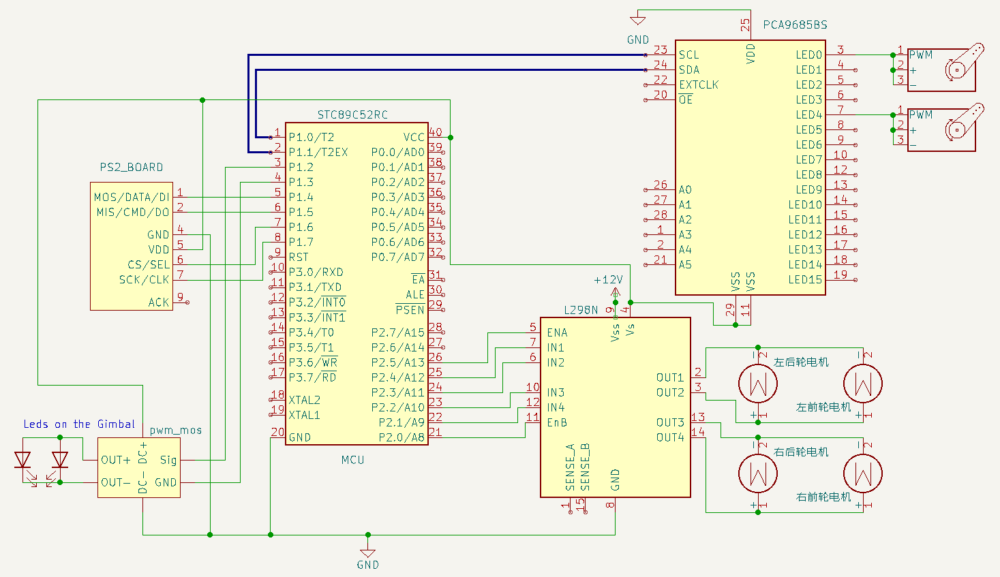

## 整体设计

## 模块说明

#### 小车底盘

外购小车底盘带直流电机。

#### 控制模块

使用51单片机（STC89C52RC）作为控制中心，其中P0口系列自带LED灯，为指令监控显示灯； P2.0-P2.5 为电机控制口，P2.6 为音乐开关。P2.7为灯组开关，P1.4-P1.7为PS2通信口。
晶振频率：11.0592

| GPIO | 连接口                        | 初始值  | 说明        |
| ---- | ----------------------------- | ------- | ----------- |
| P2_0 | L298N_EnB 右轮使能            | 0       |             |
| P2_1 | L298N_IN4 右轮前进高电平      | 0       |             |
| P2_2 | L298N_IN3 右轮后退高电平      | 0       |             |
| P2_3 | L298N_IN2 左轮前进高电平      | 0       |             |
| P2_4 | L298N_IN1 左轮后退高电平      | 0       |             |
| P2_5 | L298N_EnA 左轮使能            | 0       |             |
| P1_0 | 舵机驱动IIC总线SDA          | 0       |     |
| P1_1 | 舵机驱动IIC总线SCL           | 0       |   |
| P1_2 | 灯组开关控制信号          | 0       |     |
| P1_3 | 灯组开关控制回路           | 0       |   |
| P1_4 | PS2_D1/DATA                   | default |             |
| P1_5 | PS2_D0/CMD                    | default |             |
| P1_6 | PS2_CS                        | default |             |
| P1_7 | PS2_CLK                       | default |             |
| P0_0 | 自带LED1                      | 1       | 1命令时点亮 |
| P0_1 | 自带LED2                      | 1       | 2命令时点亮 |
| P0_2 | 自带LED3                      | 1       | 3命令时点亮 |
| P0_3 | 自带LED4                      | 1       | 4命令时点亮 |
| P0_4 | 自带LED5                      | 1       | 5命令时点亮 |
| P0_5 | 自带LED6                      | 1       | 6命令时点亮 |
| P0_6 | 自带LED7                      | 1       | 7命令时点亮 |
| P0_7 | 自带LED8                      | 1       | 8命令时点亮 |

#### 电机驱动模块

使用L298N电机驱动，左右轮分两组控制。

12V输入电压，5V输出电压为控制单板、音乐板、LED灯、PS2通信模块供电。

#### 遥控通信模块

使用PS2通信模块进行遥控。控制键说明：

| 按键     | 功能                         | 监控指示灯 |
| -------- | ---------------------------- | ---------- |
| 左侧上键 | 小车前进，长按有效，放开停止 | P0_0       |
| 左侧下键 | 小车后退，长按有效，放开停止 | P0_1       |
| 左侧左键 | 小车左转，长按有效，放开停止 | P0_2       |
| 左侧右键 | 小车右转，长按有效，放开停止 | P0_3       |
| 右侧上健 | 云台前倾                  | P0_4       |
| 右侧下键 | 云台后仰                  | P0_5       |
| 右侧左键 | 云台左转                  | P0_6       |
| 右侧右键 | 云台右转                  | P0_7       |
| 左侧1键  | 开灯                     | P0_0       |
| 左侧2键  | 关灯                     | P0_1       |
| 右侧1键  | 云台复位                  | P0_2       |
| 右侧2键  |                          | P0_3       |

#### 音乐模块

##### 方案1： FLM038A-SOP8音乐芯片模块

使用FLM038A-SOP8音乐芯片，通过P2_6控制音乐开关，如下图。可以自己焊几个三极管开关电路控制那几个开关。这个模块音乐不太适合车载激情，所以试了一下就算了。

##### 方案2： 使用ISD1820录放音芯片模块

这个芯片可以录音，相对好玩一点。如果觉得音量小，可以自己再搞个放大电路，来个广场效果的。

此芯片有多种播放模式，默认出厂带的有PLAYE、PLAYL两种，可以通过GPIO高电平控制触发。但这两种模式都是一次播放完就停止了。如果要循环播放，可以将其RECLED和PLAYL连接，进入循环播放模式。即在芯片排针后排的P-E跳帽插在里面最外侧两个针脚上。（另外一边跳帽是直通模式跳帽）

但这样做就不能通过GPIO控制播放了，会持续循环播放。因此这里将ISD1820芯片置循环播放模式，使用PWM控制器控制电源方式实现开关控制。

##### 方案3： 使用MP3模块，播放音乐

方案2问题是录音时间太短，如果想听歌，可以用MP3模块，如下图：

#### 音频放大器

用来放大ISD1820音频，如下：

#### PWM控制模块

配合音乐模块使用，实现音乐开关和切换。这玩意一定按示意图接，不能只开一路好像。

#### LED灯组模块

 两组灯，一组是车顶LED灯，用P1_2控制开关。 一组是车头灯（前后左右共4个），常亮。车顶灯使用驱动模块(如下图)，加PWM控制模块实现开关和闪烁。这里可以自己买块板子自己焊，想整什么样的就整什么样的。网上大把的教程。

##### 方案1：灯光可以是下图的闪烁灯：

##### 方案2：也可以是下图的流水灯：

##### 方案3：还可以是这样的：

也可以是下图的流水灯：

##### 方案4:也可以是声控流水灯：

